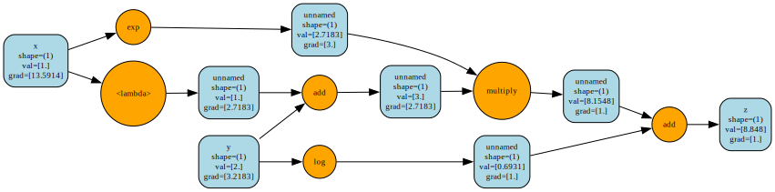

# jamgrad


Inspired by [Micrograd](https://github.com/karpathy/micrograd/tree/master) and many other light autograd implementations.

But why jamgrad? Because it's jam-packed with features! Actually, no, I am from Romania, we love making jam.

## setup
```bash
python -m venv jamenv
source jamenv/bin/activate

pip install pytest pytest-cov numpy torch scikit-learn pandas
```

## test

To run tests with verbose output:
```bash
pytest tests -v
```

With coverage:
```bash
pytest tests --cov=jamgrad
```

## visualisation of computation graph



## documentation

Generate documentation using Sphinx:

```bash
pip install sphinx sphinx-rtd-theme

make html
```

## quick start

```python
from jamgrad import Tensor

# Basic operations
x = Tensor([2.0], requires_grad=True)
y = x ** 2
y.backward()
print(x.grad)  # [4.0]

# Neural networks
from jamgrad.nn import Linear
layer = Linear(2, 1)
output = layer(Tensor([[1.0, 2.0]]))
```
