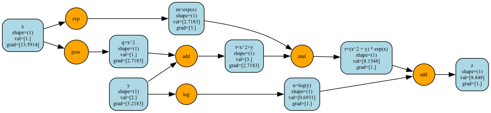

# jamgrad

[](https://github.com/nenuadrian/jamgrad/actions/workflows/python-package.yml)
[](https://github.com/nenuadrian/jamgrad/actions/workflows/docs.yml)


Inspired by [Micrograd](https://github.com/karpathy/micrograd/tree/master) and many other light autograd implementations.

But why jamgrad? Because it's jam-packed with features! Actually, no, I am from Romania, we love making jam.

## setup
```bash
python -m venv jamenv
source jamenv/bin/activate

pip install pytest pytest-cov numpy torch scikit-learn pandas
```

## test

To run tests with verbose output:
```bash
pytest tests -v
```

With coverage:
```bash
pytest tests --cov=jamgrad
```

## documentation

Generate documentation using Sphinx:

```bash
pip install sphinx sphinx-rtd-theme sphinx-autoapi

make html
```

## quick start

```python
from jamgrad import Tensor

# Basic operations
x = Tensor([2.0], requires_grad=True)
y = x ** 2
y.backward()
print(x.grad)  # [4.0]

# Neural networks
from jamgrad.nn import Linear
layer = Linear(2, 1)
output = layer(Tensor([[1.0, 2.0]]))
```

## demo

$$
z = (x^2 + y) \, e^x + \ln(y)
$$

$$
\frac{\partial z}{\partial x}
= \frac{\partial}{\partial x} \big[ (x^2 + y)e^x + \ln(y) \big]
= (2x)e^x + (x^2 + y)e^x
= e^x (2x + x^2 + y)
$$

$$
\text{At } x = 1, \, y = 2:
\quad
\frac{\partial z}{\partial x} = e^1 (2 + 1 + 2) = 5e \approx 13.591409
$$

$$
\frac{\partial z}{\partial y}
= \frac{\partial}{\partial y} \big[ (x^2 + y)e^x + \ln(y) \big]
= e^x + \frac{1}{y}
$$

$$
\text{At } x = 1, \, y = 2:
\quad
\frac{\partial z}{\partial y} = e^1 + \frac{1}{2} = e + 0.5 \approx 3.2182818
$$

$$
z = (1^2 + 2)e^1 + \ln(2)
= 3e + \ln(2)
\approx 8.847993
$$

### computation graph visualization


